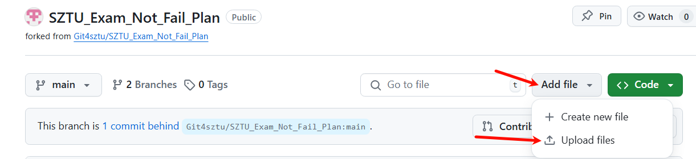
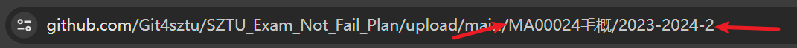
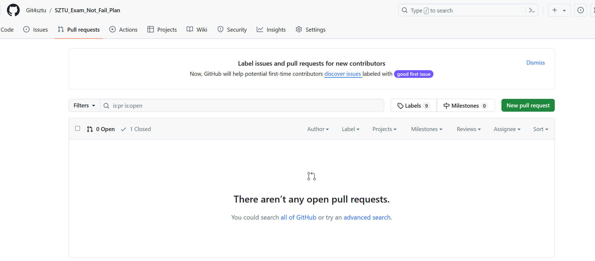
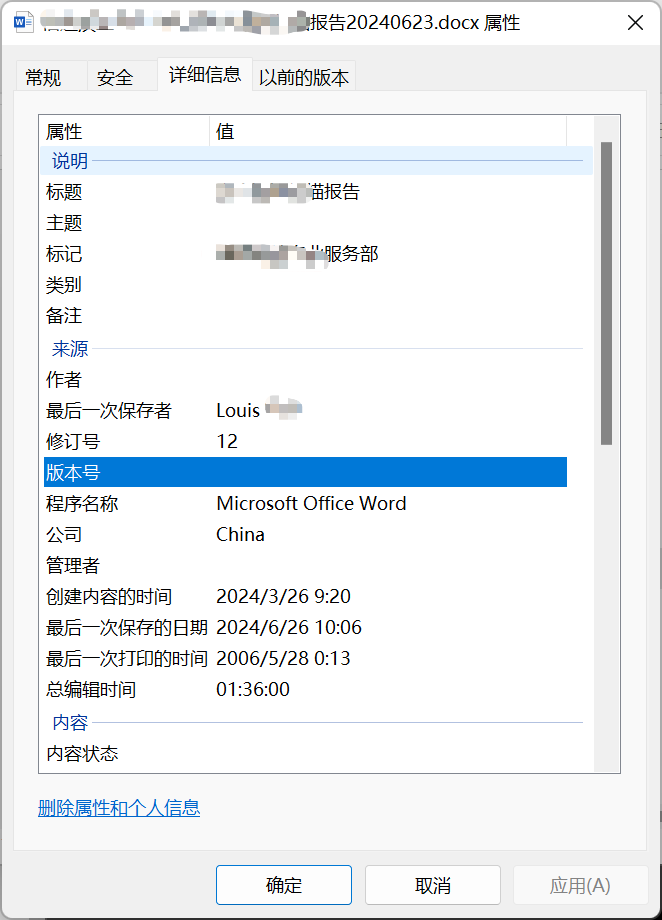

# SZTU共享不挂科计划

## 写在前面

创建本项目的初衷在于让同学们更加方便有效地进行期末复习备考。

~~自2024-2025学年起，SZTU正式开启了有两周复习周的学期形式，相比过往无复习周的学期来说，有复习周的期末考试难度必然增大~~（一个学期过去了，然而并没有复习周），加之偶然发现CUIT的共享复习资料github库，SZTU共享不挂科计划的想法由此诞生。

本项目中，你可以上传关于SZTU任意课程的专用复习资料（划重点类，网络上已公开的资料不必再上传），通过pr提交；

具体步骤：

1. fork本项目

​	

2. 对你仓库中fork过来的项目进行上传文件操作，请注意上传到对应文件夹中。

   

   若无对应文件夹，请将上传文件页面浏览器url对应的文件夹路径改为你将要创建的文件夹路径

   

3. 回到本项目提交pr

​	

若您出于个人隐私保护目的，可以选择在issue留下文件网盘链接，由项目组代上传。

## 规范

### 隐私安全规范

上传资料**不可泄露包括但不限于上传者本人以及相关教师的信息**，请检查各类文件中是否有相关信息，如有请脱敏后再上传。

请**尽可能不使用一手资料**，尽量将资料转写后再上传

##### 可能泄露的信息点与脱敏操作

1. 文件属性详情的作者、标题信息

	

2. ppt内容泄露的班级信息、教师信息
3. 音频文件的声音特征

4. 试题文件的个人姓名、学号、班级信息

### 分类与上传

#### 文件分类方式

如下图所示，找到对应"课程id课程名称"的文件夹，进入对应学期，将文件上传至此，若没有对应文件夹，请自行创建。

## 版权

若您认为该仓库的一些文件侵犯了您的权益，请通过邮箱联系anonymous4git@gmail.com。
