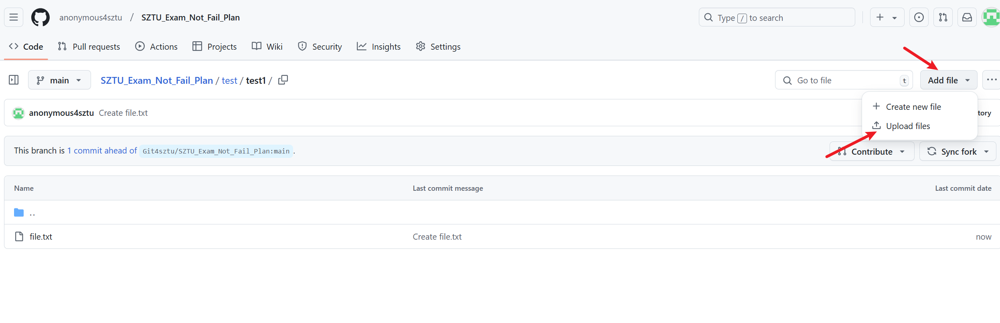
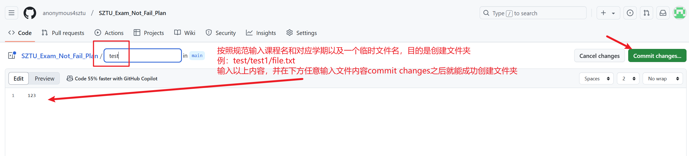
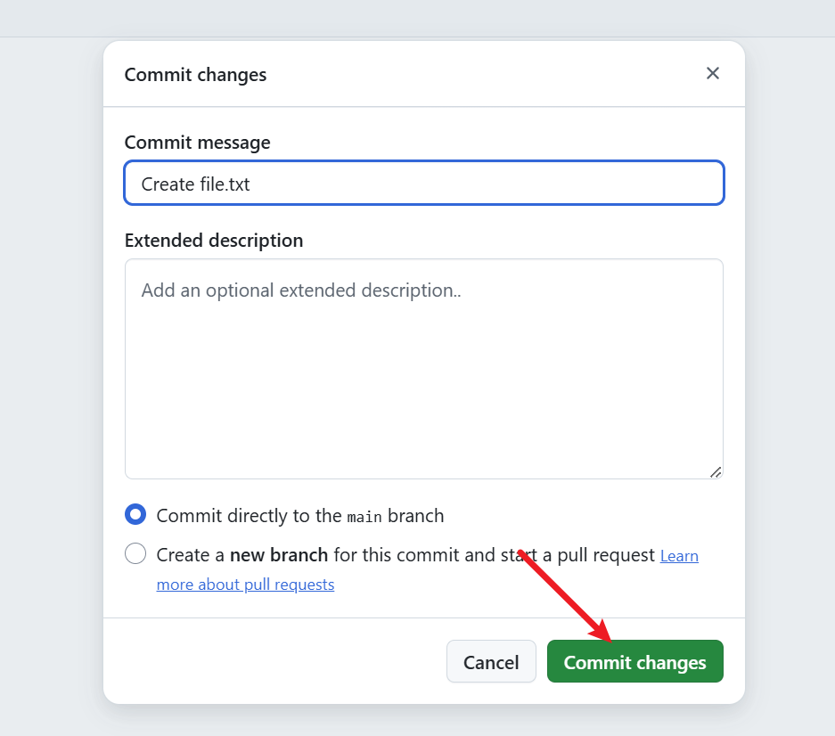

# SZTU共享不挂科计划

## 写在前面

创建本项目的初衷在于让同学们更加方便有效地进行期末复习备考。

~~自2024-2025学年起，SZTU正式开启了有两周复习周的学期形式，相比过往无复习周的学期来说，有复习周的期末考试难度必然增大~~（一个学期过去了，然而并没有复习周），加之偶然发现CUIT的共享复习资料github库，SZTU共享不挂科计划的想法由此诞生。

本项目中，你可以上传关于SZTU任意课程的专用复习资料和课程作业答案

## 上传资料方法

### fork本项目仓库

进入到刚刚fork的仓库中

下面分为两种情况

#### 存在对应文件夹

来到目录下上传即可

#### 不存在对应文件夹

点击创建新文件

输入需要创建的文件夹名和临时文件名并提交

来到创建的文件夹下上传文件

资料上传完成后记得将刚刚新建文件夹时附带的临时文件删除

### 创建拉取请求

回到fork的仓库首页，点击open pull request

填写title和description并创建拉取请求，其他选项不用改

最后等待仓库owner合并即可

若您出于个人隐私保护目的，可以将资料发送至anonymous4git@gmail.com，由项目组代上传。

## 规范

### 隐私安全规范

上传资料**不可泄露包括但不限于上传者本人以及相关教师的信息**，请检查各类文件中是否有相关信息，如有请脱敏后再上传。

##### 可能泄露的信息点与脱敏操作

1. 文件属性详情的作者、标题信息

2. 文件内容中的个人信息、教师信息、班级信息

### 分类与上传

#### 文件分类方式

如下图所示，找到对应"课程id课程名称"的文件夹，进入对应学期，将文件上传至此，若没有对应文件夹，请自行创建。

## 版权

若您认为该仓库的一些文件侵犯了您的权益，请通过邮箱联系anonymous4git@gmail.com。
